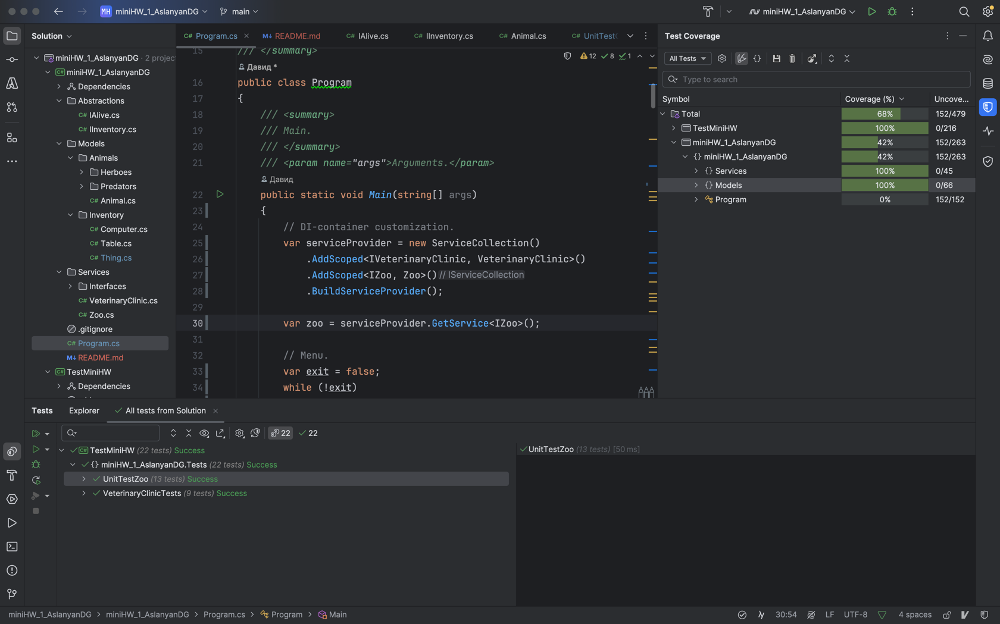

# КПО-мини-ДЗ-№1
### Выполнено студентом БПИ238, Асланян Давид

---

### **Создано консольное приложение, которое позволяет:**
1. Вести учет животных Московского зоопарка. 


2. Принимать их на баланс.


3. Выводить отчет по количеству животных, потребляемом 
ими килограммов еды в день. 


4. Формировать списки тех животных, которые могут быть 
помещены в контактный зоопарк. 


5. Выводить наименование и инвентаризационные номера 
вещей, животных, стоящих на балансе зоопарка.

---

### **Учтены Функциональные требования:**
1. Обеспечена возможность добавления новых животных 
в зоопарк.


2. Перед приемкой нового животного проверяется
его состояние здоровья (здоров / не здоров). 
Здоровье проверяет ветеринарная клиника, 
которая в ходе осмотра принимает
одно из двух решений: принять животное в зоопарк 
или отказаться от данного животного.


3. Имеется возможность информировать о том 
какое количество килограмм еды нужно всем животным.


4. Имеется возможность предоставить 
информацию о тех животных, которые могут быть
отправлены в контактный зоопарк.

---

### **Пояснения:**
1. Животное является здоровым, 
если уровень здоровья >= 5. 
2. Уровень доброты оценивается в диапазоне от 0 до 10,
другие значения не принимаются (будет предложен повторный
ввод).
3. Имя животного и Название предмета при создании, если пустые,
то выводится соответсвующее сообщение о некорректном вводе
имени.
4. Номера (ID): я сделал так, чтобы нумеровались все и животные
и вещи, каждый из этих двух типов является инвентарем в рамках зоопарка
и дублирование ID в рамках инвентаря запрещено
(иначе это будет вкорне нарушать атомарность данных).
Поэтому, если, например, добавлено животное с ID=1, то вещь с ID=1 добавить нельзя
и наоборот.
5. В контактный зоопарк попадают травоядные с добротой > 5, если вообще допущены в зоопарк по здоровью.
6. При выводе инвенторя - выводятся как животные так и вещи зоопарка с соотнветствующими пометками "Животное", "Вещь".
7. В IInventory интерфейсе помимо свойства Number от себя добавил метод **ShowInventoryInfo()**
для того, чтобы у животных и вещей с помощью реализованных в **Animal.cs** и **Thing.cs** виртуальных методов 
**ShowInventoryInfo()** был правильный вывод инвентарной информации как описано в пункте 6.
8. Так же имеется пункт выхода из консольного приложения.
9. Код покрыт документирующими комментариями, благодаря которым можно легко понять, что и зачем использовалось.

---

# 📌 Принципы SOLID в проекте

В данном проекте соблюдены основные принципы **SOLID**, что делает код гибким, расширяемым и поддерживаемым.

---

### 🔹 1. Single Responsibility Principle (SRP)
### **Принцип единственной ответственности**
Для проверки здоровья есть отдельный класс VeterinaryClinic, для учёта животных — Zoo, модельки животных живут в своих классах, что выглядит достаточно корректно с точки зрения SRP

Такое разделение улучшает читаемость и упрощает внесение изменений.


### 🔹 2. Open/Closed Principle (OCP)
### **Принцип открытости/закрытости**
Классы **открыты для расширения, но закрыты для модификации**:
- Чтобы добавить **новый тип животного**, достаточно создать новый класс, унаследованный от `Animal`, `Herbo` или `Predator`.
- Чтобы добавить **новый тип инвентаря**, достаточно создать класс, реализующий `IInventory`.


### 🔹 3. Liskov Substitution Principle (LSP)
### **Принцип подстановки Барбары Лисков**
Наследуемые классы могут **заменять базовый класс без нарушения логики**:
- `Herbo` (травоядные) и `Predator` (хищники) корректно наследуются от `Animal`.
- Любое `Animal` можно передавать в методы, ожидающие базовый тип `Animal`, **без изменения их работы**.

Это гарантирует, что программа корректно работает с разными видами животных.

---

### 🔹 4. Interface Segregation Principle (ISP)
### **Принцип разделения интерфейсов**
Классы реализуют **только те интерфейсы, которые им действительно нужны**:
- `IAlive` содержит только `Food`, потому что **животные потребляют еду**.
- `IInventory` содержит `Number`, потому что **животные и вещи могут инвентаризироваться** и `ShowInventoryInfo()`
для вывода инвентаризационной информации.

Такой подход предотвращает пояление "жирных" интерфейсов.

---

### 🔹 5. Dependency Inversion Principle (DIP)
### **Принцип инверсии зависимостей**
Используется **Dependency Injection (DI)** через **`Microsoft.Extensions.DependencyInjection`**:
- `Zoo` и `VeterinaryClinic` подключаются через абстракции `IZoo` и `IVeterinaryClinic`.
- Код не зависит от конкретных реализаций, а работает с интерфейсами.

```
var serviceProvider = new ServiceCollection()
            .AddScoped<IVeterinaryClinic, VeterinaryClinic>()
            .AddScoped<IZoo, Zoo>()
            .BuildServiceProvider();

        var zoo = serviceProvider.GetService<IZoo>();
```
Этот код использует **Dependency Injection (DI)**, где `ServiceCollection` регистрирует зависимости (`IVeterinaryClinic` и `IZoo`) с областью `Scoped`, а затем `BuildServiceProvider()` создает контейнер, позволяющий запрашивать экземпляры сервисов (`zoo = serviceProvider.GetService<IZoo>()`) без привязки к конкретным реализациям, что улучшает тестируемость и поддерживаемость кода.

`Scoped` значит, что объект будет существовать все время области видимости и после его выхода будет удаляться из памяти.

---

### ✅ Вывод
Проект соответствует **SOLID**, что делает его **расширяемым, удобным для поддержки и тестирования**.

---

# 📌 Unit тесты
Тесты написаны в отдельном проекте `TestMiniHW` данного решения `miniHW_1_AslanyanDG`

Использовался фреймворк для модульного тестирования **`xUnit`**

Использовались `Theory` и `Fact` атрибуты для тестов.

Покрытие бизнес-логики (Service, Models) проекта составило 100%, что больше требуемых в доп.задаче 60%


применялся интерфейс test coverage для просмотра процента покрытия тестами.


